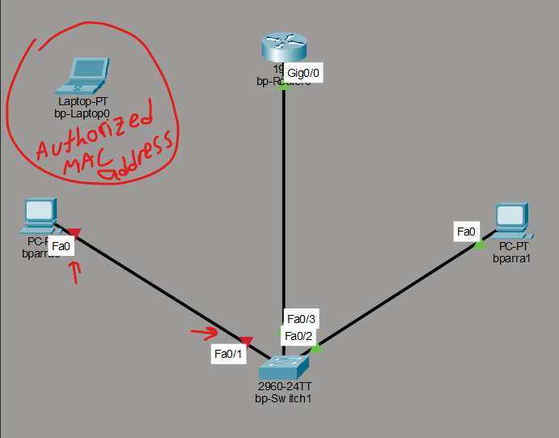

## Lab 2.5: Implementing Layer 2 Defensive Controls (Port Security)

### Objective
To implement and verify physical layer defense mechanisms at the Data Link layer (OSI Layer 2) using Cisco Port Security, preventing unauthorized devices from gaining network access via open switch ports.

### Topology Changes & Defensive Logic
* **Context:** Built directly on top of the Layer 3 routing topology.
* **Mechanism:** Configured `bp-Switch1` on port `Fa0/1` to dynamically learn the MAC address of the authorized device using the `sticky` feature. 
* **Violation Rule:** Set a strict `shutdown` policy. If an unrecognized MAC address attempts to transmit frames through the port, the switch automatically transitions the interface into an `err-disabled` state, isolating the threat.

### Interface Configuration & Threat Detection Logs
The switch CLI was configured to enforce port access constraints. Upon simulating an attack by swapping the authorized laptop for an unauthorized host (`bparra0`) and attempting an ICMP ping, the interface immediately generated real-time syslog alerts and dropped the link.

Switch Port Security Configuration and Syslog Logs! [alt text](images/image.png)
### Verification & Visual Link State
As shown below, the unauthorized communication attempt forced port `Fa0/1` into an administrative `err-disabled` shutdown state, completely isolating the host from the gateway (indicated by the solid red link lights).

Port Security Violation and Link Shutdown!
[alt text](images/image-1.png) 

### SOC Analyst Takeaway
For a Tier 1 SOC Analyst, these specific log signatures (`%PORT_SECURITY-2-PSECURE_VIOLATION`) are critical. In an enterprise environment, these strings are forwarded directly to a SIEM platform (like Splunk or Wazuh) via Syslog. Analysts utilize these exact event details to pinpoint the compromised switch, the physical port location, and the rogue MAC address to initiate incident response protocols.
