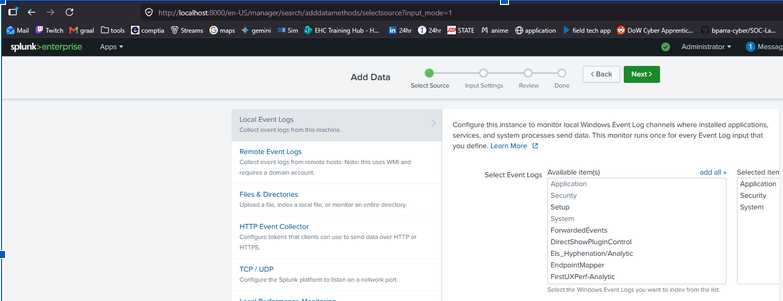
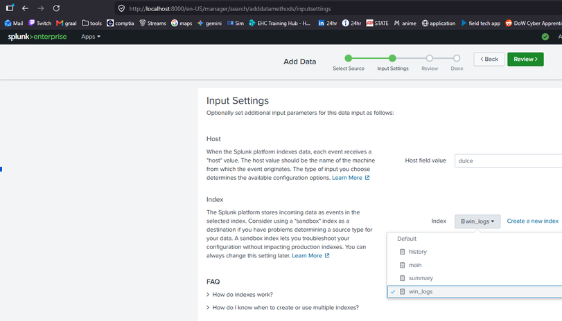
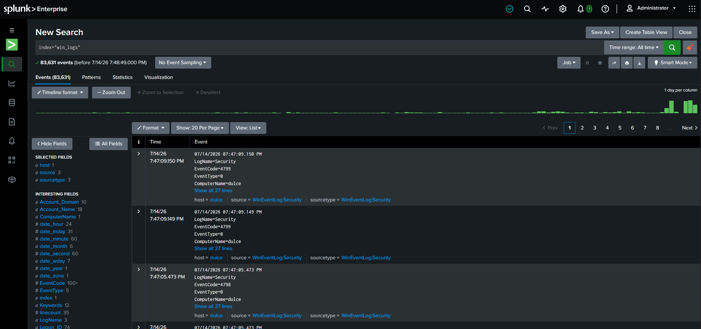
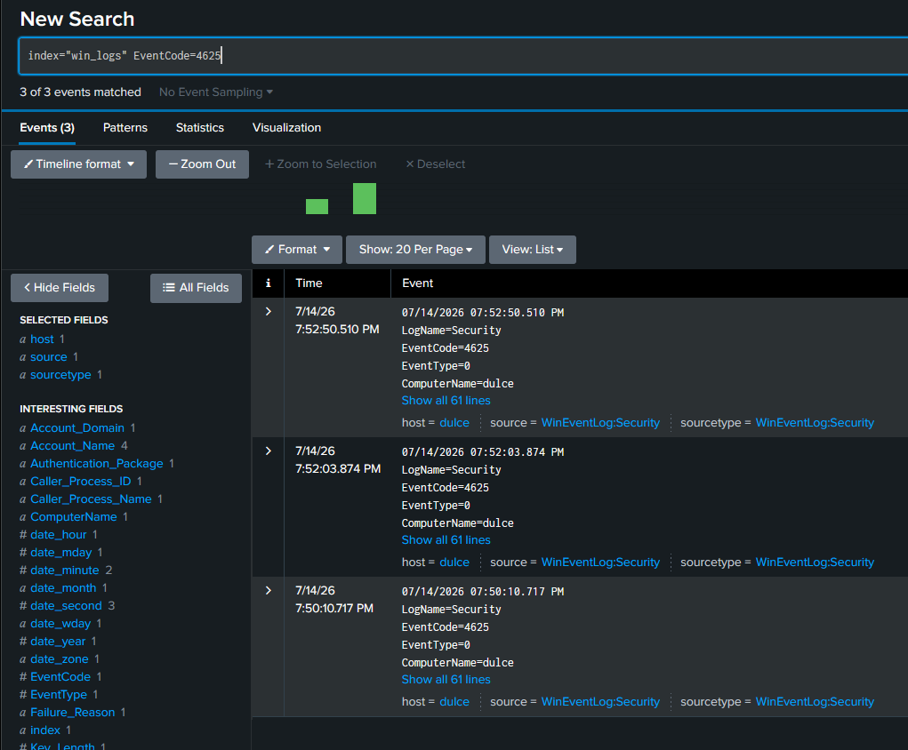
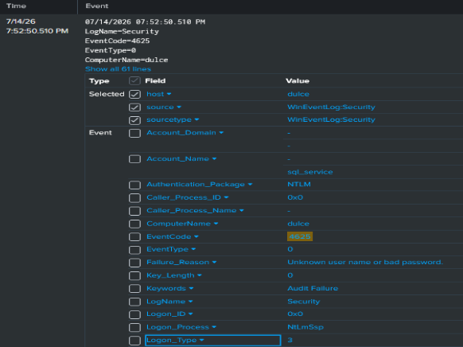

# Lab 4: Splunk SIEM Deployment & Host Telemetry Monitoring

## Lab Objectiive
This lab demonstrates the transition from network infrastructure architecture to cybersecurity operations. By deploying an enterprise-grade SIEM (Splunk) on a Windows 11 endpoint, this project established host-level visibility, configures secure log ingetion pipelines, & builds real time threat detection capabilities.

---
## 1. Custom Ingestion Pipeline & Indexing

In a production Security Operations Center (SOC), diverse log sources are never co-mingled into a single default database. This project implements database best practices by segmenting host events into an isolated, dedicated index to optimize query response times, enforce role-based access control, and manage data retention parameters.

*   **Custom Index Name:** `win_logs`
*   **Monitored Event Channels:**
    *   **Security:** Tracks critical authentication events, privilege use, and process creation.
    *   **System:** Monitors operating system errors, driver updates, and service installations.
    *   **Application:** Captures third-party software actions and runtime errors.



### Ingestion Configuration Review
Before committing the data inputs, the ingestion pipeline parameters are reviewed to ensure the targeted local event channels are correctly mapped to our custom database:



---

## 2. Ingestion Verification & Troubleshooting

To confirm that the host ingestion pipeline is operational, we execute search queries within the Splunk Search and Reporting environment.

### The Default Index (Troubleshooting)
Initially, searching without specifying our custom index or attempting to search default metadata fields yields **"No results found."** This occurs because Splunk searches the empty default `main` index if no index is explicitly specified in the search bar.

### Resolving with the Correct SPL Query
By explicitly targeting our custom index using Search Processing Language (SPL), we successfully retrieve and verify the active event streams:

```spl
index="win_logs"
```

Running this query validates that:
*   **Active Event Streams:** The indexer is successfully parsing security, system, and application events from our host (`dulce`).
*   **Time-Sync Accuracy:** Host-generated timestamps correlate accurately with the ingestion database timeline.


---

## 3. Simulated Threat Telemetry Generation (Credential Brute-Force)

To validate the SIEM's capability to capture and analyze unauthorized events, we simulated a credential-guessing/brute-force attack. 

Using administrative terminal access, we generated multiple rapid, failed network authentication attempts against non-existent local system accounts to trigger **Windows Event ID 4625** (Failed Logon).

### Attack Simulation Script:
```powershell
net use \\localhost\C$ /user:compromised_user dummy_password_123
net use \\localhost\C$ /user:admin_backup wrongpass
net use \\localhost\C$ /user:sql_service wrongpass
net use \\localhost\C$ /user:root wrongpass
```

## 4. Threat Hunting & Telemetry Analysis

With the simulated attack completed, we pivot to the role of a SOC Analyst to search and analyze the generated telemetry.

### Step A: Broad Event Inspection
First, we inspect our ingested security log to identify both the explicit failed logon attempts (`EventCode=4625`) and the logon attempts using explicit credentials (`EventCode=4648`) generated by our `net use` actions:

```spl
index="win_logs"
```
### Step B: Isolating the Failed Logons
To cut through the noise and verify our brute-force indicators, we isolate only the failed authentication events within our active search window:

```spl
index="win_logs" EventCode=4625
```

Running this query allows the analyst to extract critical Indicators of Compromise (IoCs):
*   **Targeted Accounts:** Exposing the exact fake user accounts targeted during the attempt (`compromised_user`, `admin_backup`, `sql_service`).
*   **Source Origin:** Confirming that the connection requests originated locally from workstation `dulce`.



---

## 5. SOC Analyst Triage & Pivot Analysis

When verifying authentication anomalies, a professional analyst must investigate the context, mechanism, and blast radius of the attack.

### Analyzing the Attack Vector (Logon Types)
Windows Event ID 4625 categorizes the authentication mechanism via the `Logon_Type` field. Identifying this code allows the analyst to map the adversary's lateral movement vector:
*   **Logon Type 2 (Interactive):** Indicates physical console access (physical security risk).
*   **Logon Type 3 (Network):** Indicates connection via SMB, network shares, or command-line utilities (e.g., our `net use` simulation).
*   **Logon Type 10 (RemoteInteractive / RDP):** Indicates an attempt via Remote Desktop Protocol. This is a common target for external, internet-facing brute-force exposure.



### Verification of Compromise (The Pivot Search)
The most critical phase of triage is verifying if the credential-guessing attempt succeeded. A SOC analyst executes a follow-up pivot query to search for a corresponding Successful Logon (**Event ID 4624**) from the same source origin within the same attack window:

```spl
index="win_logs" (EventCode=4625 OR EventCode=4624) 
| table _time, EventCode, Account_Name, ComputerName, Logon_Type
```

*   **Triage Conclusion:** If a `4624` event succeeds after a string of `4625` events for the same account, the incident is immediately escalated to **Severity 1 / Incident Response** for host isolation. If no `4624` exists, the attack was successfully mitigated by existing credential controls.

---

## Core Telemetry Indicators Memorized
Immediate mental recall of foundational Windows Event IDs is critical for rapid, accurate triage operations:

| Event ID | Log Category | Defensive Significance |
| :--- | :--- | :--- |
| **4624** | Security | **Successful Logon** (Tracks user and service authentication) |
| **4625** | Security | **Failed Logon** (Key indicator of credential brute-forcing) |
| **4688** | Security | **New Process Created** (Tracks malicious execution and command-line arguments) |
| **7045** | System | **New Service Installed** (Common persistence mechanism used by threat actors) |