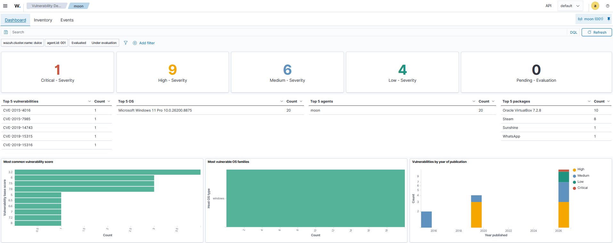
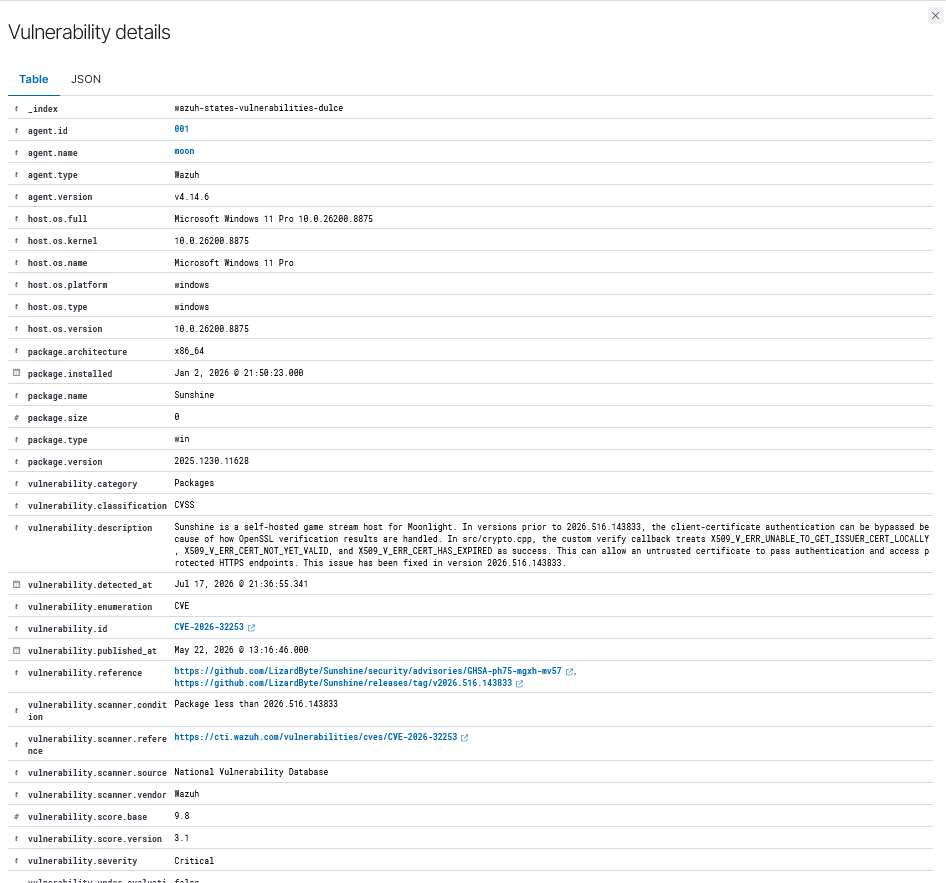

# Project: Local EDR Deployment & Host Vulnerability Triage (Wazuh SIEM)

## Objective
To utilize an enterprise EDR/SIEM agent (Wazuh) to conduct an automated credentialed vulnerability assessment on a live local workstation, analyze the risk posture against the global CVE database, execute standard vendor remediation, and verify threat mitigation through telemetry synchronization.

---

## Phase 1: Attack Surface Discovery
Upon initial synchronization of the Wazuh agent on the host system, a comprehensive vulnerability scan was executed against the local package architecture to map out the endpoint's exposed attack surface.

### Host Profile
* **Target Host Name:** DULCE
* **Operating System:** Microsoft Windows 11 Pro (10.0.26200.8875)
* **Hardware Profile:** AMD Ryzen 9 5900X 12-Core Processor / 32GB RAM

### Initial Risk Posture Assessment
The initial baseline telemetry ingestion uncovered a localized footprint of several unpatched legacy applications:

* **Critical Severity:** 1
* **High Severity:** 9
* **Medium Severity:** 6
* **Low Severity:** 4



---

## Phase 2: Triage & Analysis of Critical Risk
A deep-dive investigation was conducted into the single flagged **Critical** threat to determine its potential impact and exploit path.

*   **Vulnerable Application:** Sunshine (Self-hosted game stream host)
*   **Assigned CVE Identifier:** CVE-2026-32253
*   **CVSS v3.1 Base Score:** 9.8 (Critical)
*   **Vulnerability Description:** In versions prior to `2026.516.143833`, a critical flaw exists in how OpenSSL verification results are handled during client-certificate authentication. The custom verify callback within `src/crypto.cpp` treats structural errors (such as `X509_V_ERR_UNABLE_TO_GET_ISSUER_CERT_LOCALLY`) and expired certificates as a successful validation. This allows an untrusted, unauthenticated network adversary to completely bypass identity enforcement controls and gain direct access to protected administrative HTTPS endpoints on the host machine.



---

## Phase 3: Defensive Remediation Strategy & Verification
To mitigate the identified exposure, a full vulnerability management lifecycle was completed by manually applying the vendor-supplied patch and forcing an EDR re-evaluation loop.

### 1. Patch Implementation
The security advisory requires moving the endpoint past version `2026.516.143833` to implement the hardened SSL certificate verification logic. 

*   **Action Taken:** Executed the upgraded production installer package for Sunshine on the target host.
*   **Result:** Application verified upgraded to secure baseline `v2026.516.143833`, resolving the underlying validation flaw.


### 2. Windows Agent Synchronization
By default, the EDR agent’s system collector inventories software on a delayed periodic cycle. To begin verifying the fix, a manual software inventory sweep was forced on the host side.

**Windows Endpoint Agent (Elevated Administrator PowerShell):**
```powershell
Restart-Service -Name wazuh
```

### 3. Linux SIEM Manager Synchronization
Next, the backend SIEM architecture processing pipelines were cycled to instantly ingest and parse the incoming updated package database metrics.

**Linux SIEM Manager (WSL Ubuntu Instance):**
```bash
sudo systemctl restart wazuh-indexer wazuh-manager wazuh-dashboard
```

### 4. Final Posture Verification
Following the manual daemon synchronization loop, the Wazuh Vulnerability Detection engine re-evaluated the host package registry against the national vulnerability feeds.

*   **Critical Vulnerability Count:** Successfully dropped from **1 to 0**.
*   **Status:** CVE-2026-32253 completely mitigated; host threat exposure resolved.

