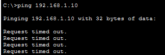
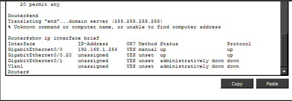
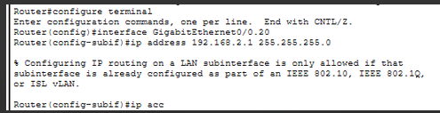
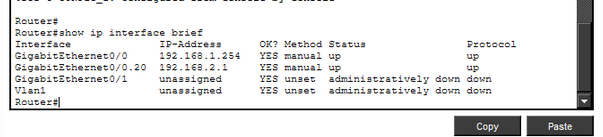
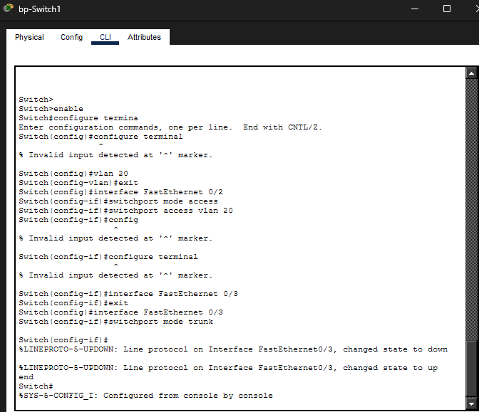
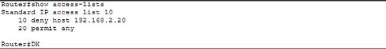
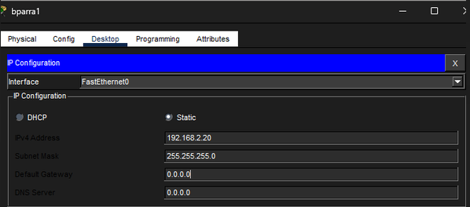
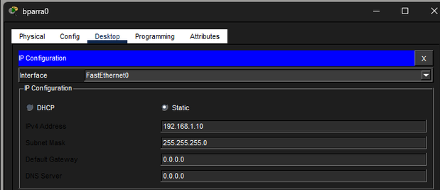
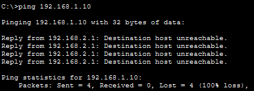

# Lab 3: Router-on-a-Stick VLAN Routing and Standard ACL Enforcement

## 1. Project Overview & Objectives
This lab focuses on configuring and troubleshooting a **Router-on-a-Stick (RoaS)** network topology inside Cisco Packet Tracer. The objective is to isolate endpoints into separate virtual local area networks (VLANs), route inter-VLAN traffic across a single physical trunk link, and enforce targeted security policies using a Standard Access Control List (ACL). 

### Key Milestones Completed:
* Designed and deployed a physical-to-logical Router-on-a-Stick topology.
* Resolved out-of-order Access Control List parsing logic.
* Configured Layer 2 802.1Q trunking links and VLAN mapping on an access switch.
* Provisioned subinterfaces with matching dot1Q tags and gateway IPs on a Cisco router.
* Troubleshot and resolved localized host networking configurations (Default Gateways).

---

## 2. Network Topology & Addressing Table

| Device | Interface / Subinterface | IP Address | Subnet Mask | Default Gateway | VLAN Assignment |
| :--- | :--- | :--- | :--- | :--- | :--- |
| **bp-Router0** | Gig0/0 | *Physical Link Only* | N/A | N/A | Trunk Trunking Link |
| **bp-Router0** | Gig0/0.20 | 192.168.2.1 | 255.255.255.0 | N/A | VLAN 20 Virtual Gateway |
| **bparra0** | Fa0 | 192.168.1.10 | 255.255.255.0 | 192.168.1.254 | VLAN 1 (Default) |
| **bparra1** | Fa0 | 192.168.2.20 | 255.255.255.0 | 192.168.2.1 | VLAN 20 |

---

## 3. Configuration Artifacts

### bp-Router0 Subinterface & ACL Configuration
```text
interface GigabitEthernet0/0.20
 encapsulation dot1Q 20
 ip address 192.168.2.1 255.255.255.0
 ip access-group 10 in
!
access-list 10 deny host 192.168.2.20
access-list 10 permit any
```

### bp-Switch1 Port Customization
```text
vlan 20
!
interface FastEthernet0/2
 switchport mode access
 switchport access vlan 20
!
interface FastEthernet0/3
 switchport mode trunk
```

---

## 4. Chronological Troubleshooting Ledger & Screenshots

### Phase 1: Identifying Out-of-Order ACL Parsing Logic
The lab initially failed because a broad `permit any` rule was evaluated before a specific `deny host` statement inside Access Control List 10. Due to Cisco's "First Match Wins" architecture, the router skipped the block completely. Furthermore, attempts to ping resulted in an absolute `Request timed out`, pointing to an infrastructure routing error deeper in the network.



*Figure 1: Router CLI highlighting incorrect ACL rule sorting order and subsequent host ICMP timeout drops.*

### Phase 2: Verifying Router Subinterface Status
Running the `show ip interface brief` command revealed that while the primary physical interface `GigabitEthernet0/0` had an assigned IP, the subinterface managing the new segment (`GigabitEthernet0/0.20`) was currently `unassigned`. This meant packets had no router-side gateway interface to communicate with.

  
*Figure 2: Router configuration state revealing an unassigned IP on the virtual VLAN 20 interface.*

### Phase 3: Enforcing Dot1Q Encapsulation Order of Operations
When attempting to force-assign an IP to the virtual subinterface, Cisco IOS rejected the command, stating that IP routing on a LAN subinterface is only allowed once it has been configured as part of a VLAN. The router must be told how to trunk using 802.1Q tagging protocol before it can hold a logical network address.



*Figure 3: Cisco IOS command rejection warning requiring explicit VLAN encapsulation sequencing.*

### Phase 4: Activating the Subinterface Gateway
Following proper sequencing, the subinterface was bound to VLAN 20 using the command `encapsulation dot1Q 20`, and then successfully assigned its gateway address of `192.168.2.1`. Running verification showed both Status and Protocol transitioned into an active `up / up` state.

 

*Figure 4: Interface brief validating that GigabitEthernet0/0.20 is active and properly online.*

### Phase 5: Troubleshooting Layer 2 Switch Infrastructure
Even with the router subinterface online, ICMP traffic continued to time out. Checking Layer 2 configurations revealed the switchports were unmapped. The endpoint `bparra1`'s physical access interface (`Fa0/2`) had to be mapped to `switchport access vlan 20`, and the interface to the router (`Fa0/3`) changed to `switchport mode trunk` to carry the tagged traffic upstream.


*Figure 5: Switch CLI showing successful mapping of the VLAN 20 access port and line-protocol activation of the 802.1Q trunk.*

### Phase 6: Verifying Null Access-List Hits
With the Layer 2 and Layer 3 plumbing set, running `show access-lists` on the router still returned zero active telemetry match hits. This behavior proved that packets were still dropping locally on the client machines before arriving at the router interface.



*Figure 6: Access-list telemetry validating that no data packages were reaching the router's interface.*

### Phase 7: Remediating Localized Host Default Gateways
Inspecting the network configuration profiles on both `bparra1` and `bparra0` exposed the ultimate point of failure: both machines had their Default Gateway fields set to `0.0.0.0`. Because the destination was outside their native subnets, the computers were dropping the traffic internally because they lacked a path out of their local networks.



*Figure 7: Endpoint IP Configuration showing a dead 0.0.0.0 default gateway loop.*

 

*Figure 8: Host bparra0 exhibiting matching default gateway unassignment errors.*

### Phase 8: Final Successful Verification
After updating the default gateways to point directly to their respective router subinterface addresses (`192.168.2.1` for VLAN 20 and `192.168.1.254` for VLAN 1), a final test ping was executed. The packet successfully left the host, traveled through the switch trunk, hit the router's access-list security guard, and returned the target deployment response.



*Figure 9: Verification window showing successful, immediate 'Destination host unreachable' returns from the default gateway.*

---

## 5. Key Core Concepts Learned

### The Role of Default Gateways
A **Default Gateway** is the dedicated exit route for packets bound for an outside network segment. When a computer detects that a destination IP address sits outside its local subnet mask boundaries, it cannot complete communication using a standard Layer 2 local broadcast. Instead, it encapsulates the frame and forwards it directly to the MAC address of its default gateway. If this gateway is unassigned or configured to a dead loop like `0.0.0.0`, the operating system immediately drops the traffic locally, preventing it from entering the network medium.

### Access Control List Order of Operations
Standard Access Control Lists use a strict sequential, top-to-bottom architecture. The moment a packet satisfies an entry parameter, further evaluation stops, and the router executes the rule (`permit` or `deny`). If a wide-open `permit any` statement sits above specific blocks, the traffic matches the permissive rule first and bypasses security enforcement entirely. Additionally, routers have a hidden **implicit deny all** statement at the very bottom of every list. If a packet reaches the end without a match, it is silently dropped; therefore, an explicit trailing `permit any` is mandatory to keep general, non-restricted traffic flowing freely.
